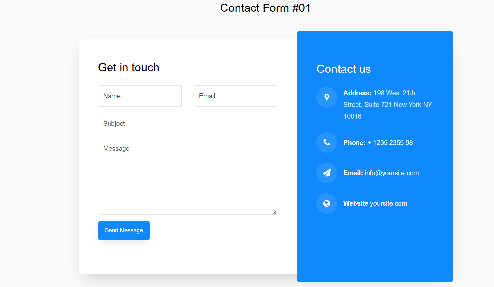

# Contact-Zenhook

## Project Overview
This project, **Contact-Zenhook**, is a contact form application built with React for the frontend and Node.js/Express for the backend. The form allows users to submit their name, email, subject, and message, which are then sent as an email using Nodemailer and OAuth2 for secure authentication.



## Technologies Used
- **Frontend**: React.js
- **Backend**: Node.js, Express.js
- **Email Service**: Nodemailer with OAuth2 (Google API)
- **Other Dependencies**:
  - `body-parser`: Middleware for parsing incoming request bodies.
  - `dotenv`: To manage environment variables.
  - `cors`: For enabling cross-origin resource sharing.
  - `axios`: For making HTTP requests from the React frontend to the Express backend.

## Installation Instructions
1. **Clone the Repository**:
   ```bash
   git clone https://github.com/yourusername/contact-zenhook.git
   cd contact-zenhook
   ```

2. **Install Backend Dependencies**:
   Navigate to the backend directory and run:
   ```bash
   npm install
   ```

3. **Install Frontend Dependencies**:
   Navigate to the frontend directory and run:
   ```bash
   npm install
   ```

4. **Set Up Environment Variables**:
   Create a `.env` file in the root of the project and add your credentials:
   ```
   USER=youremail@gmail.com
   CLIENT_ID=your-google-client-id
   CLIENT_SECRET=your-google-client-secret
   ACCESS_TOKEN=your-google-access-token
   REFRESH_TOKEN=your-google-refresh-token
   ```

5. **Start the Backend Server**:
   ```bash
   npm start
   ```

   The server will run on `http://localhost:3000`.

6. **Start the Frontend**:
   Navigate to the frontend directory and run:
   ```bash
   npm start
   ```

   The frontend will run on `http://localhost:3000`.

## API Endpoints
- **POST /sendMail**: This endpoint is used to send the contact form details as an email. It accepts `name`, `email`, `subject`, and `body` in the request body.

## Running the Application
1. **Start the Backend**: 
   ```bash
   npm start
   ```

2. **Start the Frontend**:
   ```bash
   npm start
   ```

3. Open `http://localhost:3000` in your browser to access the contact form.

## Future Improvements
- Add validation to the contact form fields.
- Improve error handling and user feedback.
- Implement additional authentication mechanisms for enhanced security.

## License
This project is licensed under the MIT License. See the [LICENSE](LICENSE) file for details.

---
